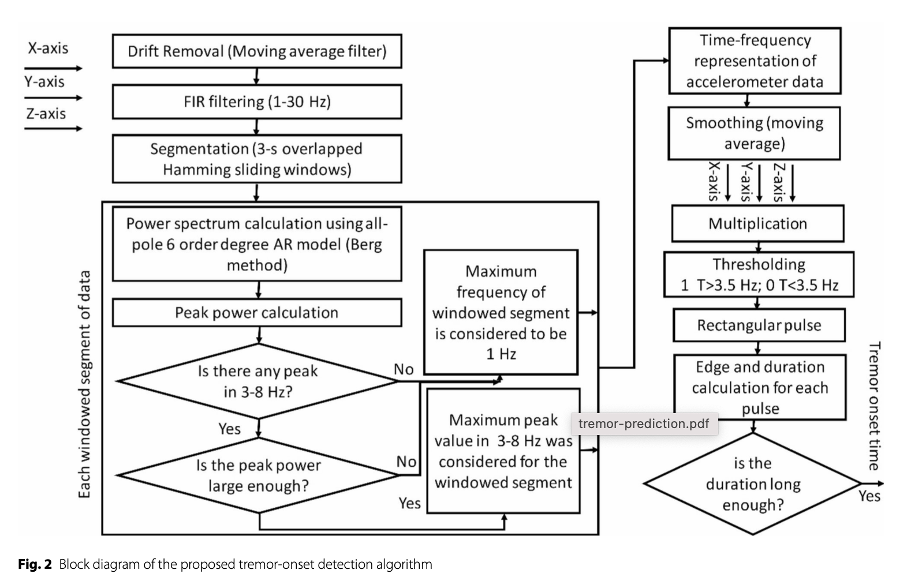
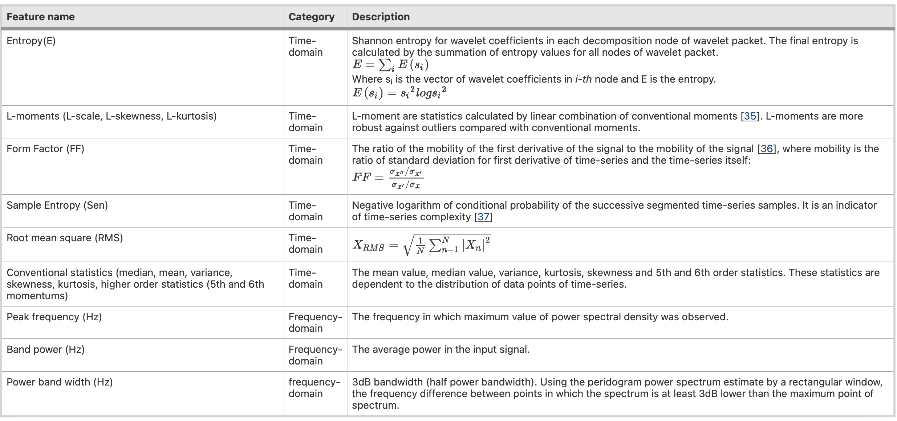

# Parkinson's Hand Tremor Prediction using ML

This is a project under **NeuroTech UofT** that aims to detect Parkinson's tremor using machine learning. The model will be integrated with hardware devices to intervene with tremors in PD patients. The project is divided into two parts: the first part uses traditional ML methods (using `scikit-learn` and `xgboost`) to classify tremor data, while the second part uses deep learning methods (using `pytorch`).

## Method 1: Traditional ML

The first part of the project follows [this research paper][1] in preprocessing the public accelerometer and EEG data, then using simple ML tools such as KKN and SVM to classify it into "pre-tremor", "tremor" and "non-tremor" classes.

### Data Preprocessing

First, we use the accelerometer data to extract tremor offset times, which are labels to be used in the classification because event labels are not given. This is implemented in `preprocessors/acc_preprocessor.py` Please refer to the paper for the complete algorithm:



The EEG data is first preprocessed by filtering and applying ICA. Then, we use the extracted timestamps for tremor onset and offset to label and segment the EEG data into epochs with "pre-tremor", "tremor" and "non-tremor" classes. The results are saved in the `processed/eeg_data` directory. This is implemented in `preprocessors/eeg_preprocessor.py`.

### Feature Extraction

After preprocessing the data, you can load the eeg_data from `processed/eeg_data` using the `EEGDataLoader` class in `preprocessors/eeg_loader.py`. This class contains all the feature extraction methods and provide methods to obtain the features and labels for classification directly.

The following features are then extracted from each segment:



### Classification

Finally, we train a classifier using the extracted features to predict the labels (pre-tremor, tremor, control). We used XGBoost in `models/xgb_model.py`.

## Method 2: Deep Learning

### Preprocessing

The second part of the project leverages latest advancements in deep learning to compare model performance with traditional ML methods. We rely on a different dataset in `new_data` directory. The data is first segmented into sliding windows and classified into non-tremor, pre-tremor, and tremor classes based on the given events label (more information are given in `experiments/create_windows.ipynb`).

> No manual extraction of features are conducted in this part.

### Model

We train a CNN-LSTM model to classify the segmented data. The model is implemented in `models/cnn_lstm_1d.py`. The model is trained using the `experiments/train_cnn_lstm.ipynb` notebook on Google Colab. We analysed the classification results using metrics like accuracy, precision, recall, and F1-score and training and validation loss in the `results` directory.

## Documentation

Repository structure:

```text
.
├── experiments/ # Jupyter notebooks for data analysis, training...
├── data/ # Original dataset files (.fif)
├── models/ # Models and helpers (e.g. loaders)
├── new_data/ # New dataset files (.bdf)
├── preprocessors/ # EEG and Accelerometer data preprocessing
├── processed/ # Processed data outputs
├── results/ # Model evaluation results
└── weights/ # Saved model weights
```

1. **Data Preprocessing**: Cleaned EEG data from original dataset are stored in `processed/eeg_data` directory. If it is not complete you should generate them yourself by running `preprocessors/run_preprocess.py`.

2. **New dataset preprocessing**: The new dataset should be downloaded from Google Drive instead. After that, the `create_windows.ipynb` notebook helps to clean and segment and save it as a pytorch tensor file.

3. **Running models**: Use models from `models` and refer to notebooks in `experiments` to train and evaluate the models. If you are using the new dataset, `models/loader.py` provides some helper utilities.

4. **Results**: Selected model weights are saved and uploaded to `weights`, as well as training results in `results`. The naming convention is `*_old` for the original dataset and `*_new` for the new dataset.

[1]: https://bmcneurol.biomedcentral.com/articles/10.1186/s12883-023-03468-0
